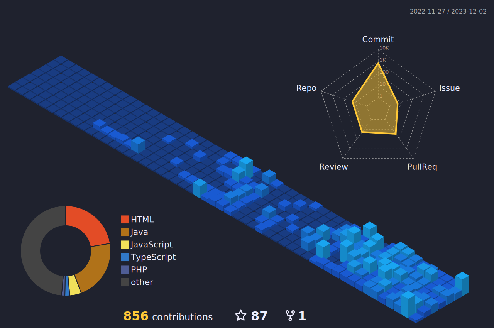

    
  
  

</a>

  
  
  

 
  
  

   
  

    
 

   <a href="https://github.com/epicestudar?tab=repositories">
    
    
   

  

   
<h2>🏆 Troféus do Github</h2>

   

 
<h2>📊Estatísticas do Perfil</h2>

  <a href="https://github.com/epicestudar">
      <source media="(prefers-color-scheme: light)" srcset="src/images/profile-3d/profile-custom-season.svg" width = "98%">
      
    </a>    

   
<h2>💻 Aprendendo e Codando:</h2>

    <h3>👨‍💻 Linguagens de Programação</h3>
    

      
      
      
       
      
      
      
  

  <h3>👨‍💻 Linguagens de Marcação</h3>
  

     
     
      
  

  <h3>🧰 Frameworks</h3>
  

     
     
    
     
     
    
    
    
     
     
     
  

   <h3>🗄️ Banco de Dados e Armazenamento em Nuvem</h3>

  

      
    
    
      
    
  

  <h3>🛠️ Ferramentas de Trabalho</h3>
  

     
      
      
      
      
  
   
   

     
<h2>📋Projetos</h2>
 
     
 
    
<h3>👨‍💻Solo</h3>

     

    <a href="https://github.com/epicestudar/BMI_Calculator">
        
       <a href="https://github.com/epicestudar/stopwatch">
        
         <a href="https://github.com/epicestudar/Digital_Bank">
        
            <a href="https://github.com/epicestudar/Loja_De_Carros">
        
               <a href="https://github.com/epicestudar/Memory_Game">
        
                 <a href="https://github.com/epicestudar/Pizzaria">
        
                      <a href="https://github.com/epicestudar/Plataforma_EAD">
        
                        <a href="https://github.com/epicestudar/Hostly-spring-API">
        
                          <a href="https://github.com/epicestudar/Hostly-java-interface">
        
     

         
    
           

    
<h3>🏢Grupo</h3>

     

          
    <a href="https://github.com/ProjectPOOCalculator/CalculatorLayout">
        
       <a href="https://github.com/OZimbres/VTL-SA2">
        
       <a href="https://github.com/Epic-s-Projects/Gerenciamento_de_Estoque">
        
    <a href="https://github.com/epicestudar/JogoDaMemoria">
        
      <a href="https://github.com/epicestudar/Votefy">
        
     

         

   
    
     
<h2>📚Cursos Presenciais</h2>

         

            
<h3>📕Senai - Limeira, Brazil</h3>

     

          
      
           
             
                
                
         
       <a href="https://github.com/epicestudar/BancoDeDados">
        
         <a href="https://github.com/epicestudar/4termo_SENAI">
        
     

          
    
             

                
<h3>🖥️Cursos Online</h3>

  

          
      
     

               

     

   

          
<b>count++ </b>
  
    

 
     
  

<picture>
  <source media="(prefers-color-scheme: dark)" srcset="https://raw.githubusercontent.com/epicestudar/epicestudar/output/pacman-contribution-graph-dark.svg">
  <source media="(prefers-color-scheme: light)" srcset="https://raw.githubusercontent.com/epicestudar/epicestudar/output/pacman-contribution-graph.svg">
  
</picture>
