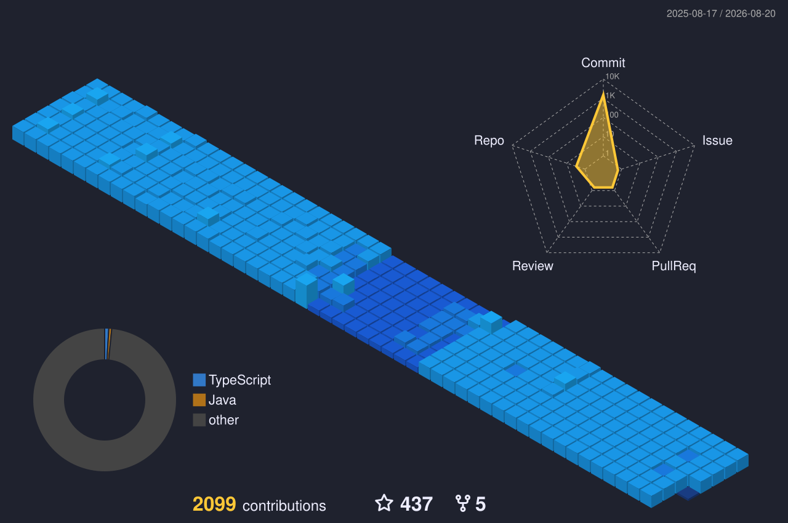

    
  
  

  
  
  

 
  
  

   
  

    
 

   
   

  

   
<h2>🏆 Troféus do Github</h2>

   

 
<h2>📊Estatísticas do Perfil</h2>

  <a href="https://github.com/vinicius-granco">
    <picture>
      <source media="(prefers-color-scheme: light)" srcset="src/images/profile-3d/profile-custom-season.svg">
      
    </picture>
  </a>    

   
<h2>💻 Aprendendo e Codando:</h2>

    <h3>👨‍💻 Linguagens de Programação</h3>
    

      
      
      
       
      
      
      
  

  <h3>👨‍💻 Linguagens de Marcação</h3>
  

     
     
      
  

  <h3>🧰 Frameworks</h3>
  

     
     
    
     
     
    
    
    
     
     
     
  

   <h3>🗄️ Banco de Dados e Armazenamento em Nuvem</h3>

  

      
    
    
      
    
  

  <h3>🛠️ Ferramentas de Trabalho</h3>
  

     
      
      
      
      
  

<picture>
  <source media="(prefers-color-scheme: dark)" srcset="https://raw.githubusercontent.com/vinicius-granco/vinicius-granco/output/pacman-contribution-graph-dark.svg">
  <source media="(prefers-color-scheme: light)" srcset="https://raw.githubusercontent.com/vinicius-granco/vinicius-granco/output/pacman-contribution-graph.svg">
  
</picture>
