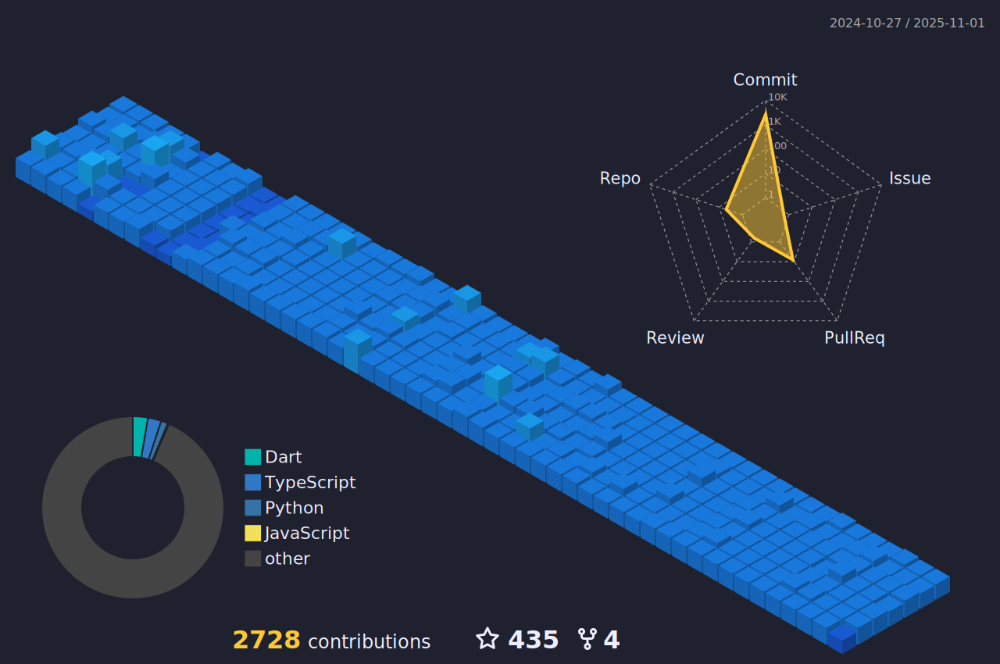

    
  
  

</a>

  
  
  

 </a>
  
  

   
  

    
 

   <a href="https://github.com/epicestudar?tab=repositories">
    
    
   

  

   
<h2>🆠Troféus do Github</h2>

   

 
<h2>📊Estatísticas do Perfil</h2>

  <a href="https://github.com/epicestudar">
      <source media="(prefers-color-scheme: light)" srcset="src/images/profile-3d/profile-custom-season.svg" width = "98%">
      
    </a>    

   
<h2>💻 Aprendendo e Codando:</h2>

    <h3>👨‍💻 Linguagens de Programação</h3>
    

      
       
       
      
      
      
  

  <h3>👨‍💻 Linguagens de Marcação</h3>
  

     
     
  

  <h3>🧰 Frameworks</h3>
  

     
      
  

   <h3>🗄️ Banco de Dados e Armazenamento em Nuvem</h3>

  

      
      
      
  

  <h3>🛠️ Ferramentas de Trabalho</h3>
  

      
      
      
      
      
  
   
   

     
<h2>📋Projetos</h2>
 
     
 
    
<h3>👨‍💻Solo</h3>

     

          
    <a href="https://github.com/epicestudar/BMI_Calculator">
        
       <a href="https://github.com/epicestudar/stopwatch">
        
         <a href="https://github.com/epicestudar/Digital_Bank">
        
            <a href="https://github.com/epicestudar/Loja_De_Carros">
        
               <a href="https://github.com/epicestudar/Memory_Game">
        
     

         
    
           

    
<h3>🏢Grupo</h3>

     

          
    <a href="https://github.com/ProjectPOOCalculator/CalculatorLayout">
        
       <a href="https://github.com/OZimbres/VTL-SA2">
      
     

         

   
    
     
<h2>📚Cursos Presenciais</h2>

         

            
<h3>📕Senai - Limeira, Brazil</h3>

     

          
      
           
             
                
                
     

          
    
             

                
<h3>🖥️Cursos Online</h3>

  

          
      
     

               

     

   

          
<b>count++ </b>
  
    

 
     
  

    
  

